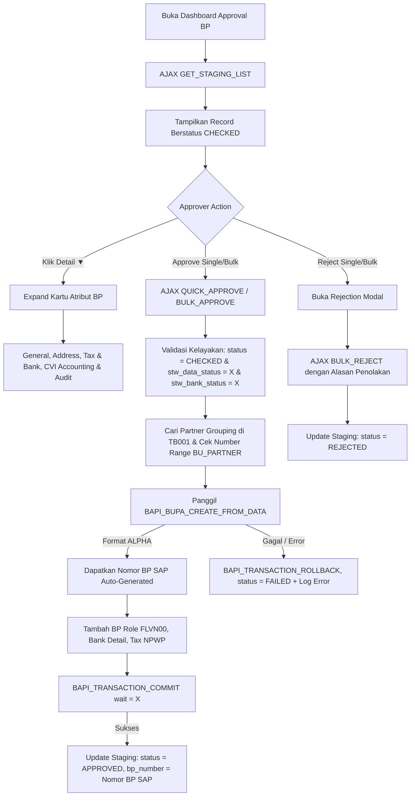

# Ringkasan Analisis Module Approval Staging Business Partner (MDG BP)

Dokumentasi ini berisi ringkasan analisis dan panduan teknis mengenai halaman [approve_bp.htm](file:///d:/DANIEL/ANTIGRAVITY/MASTER%20DATA%20GOVERNANCE/MATERIAL%20MASTER/Approval/approve_bp/approve_bp.htm) dan controller backend [onInputProcessingR.abap](file:///d:/DANIEL/ANTIGRAVITY/MASTER%20DATA%20GOVERNANCE/MATERIAL%20MASTER/Approval/approve_bp/onInputProcessingR.abap) / [OnInitialization.abap](file:///d:/DANIEL/ANTIGRAVITY/MASTER%20DATA%20GOVERNANCE/MATERIAL%20MASTER/Approval/approve_bp/OnInitialization.abap).

---

## 1. Deskripsi Singkat

Halaman **Business Partner Governance - Approval Center** digunakan oleh Approver Eksekutif untuk memeriksa, memvalidasi permohonan yang telah lolos validasi bertingkat, dan mengeksekusi Approval akhir yang secara otomatis memicu proses pembuatan master data Business Partner di SAP S/4HANA.

- **Teknologi**: SAP BSP (Business Server Pages), ABAP Backend, HTML5, Tailwind CSS, JavaScript (AJAX).
- **Entitas Database**: `zmdg_bp_req` (Database Staging SE11).
- **Standard SAP Objects**:
  - Number Range Object: `BU_PARTNER`
  - Grouping Table: `TB001`
  - BAPI Creation: `BAPI_BUPA_CREATE_FROM_DATA`
  - Role Assignment: `BAPI_BUPA_ROLE_ADD_2`
  - Bank Details: `BAPI_BUPA_BANKDETAIL_ADD`
  - Tax / NPWP: `BAPI_BUPA_TAX_ADD`
  - Transaction Control: `BAPI_TRANSACTION_COMMIT` / `BAPI_TRANSACTION_ROLLBACK`

---

## 2. Diagram & Ringkasan Alur Kerja (Workflow)

### Tahapan Alur Utama:
1. **Penyaringan Ketat (2-Stage Approval Prerequisite)**:
   - Data hanya muncul di halaman `approve_bp.htm` jika telah berstatus `CHECKED` dan telah disetujui penuh oleh **Data Steward** (`stw_data_status = 'X'`) dan **Bank Steward** (`stw_bank_status = 'X'`).
2. **Auto-Generate Nomor BP Standard SAP**:
   - Sistem membaca konfigurasi number range standard SAP (`BU_PARTNER`) dan grouping aktif (`TB001`).
   - Eksekusi `BAPI_BUPA_CREATE_FROM_DATA` membuat master record Business Partner di SAP secara otomatis.
   - Penambahan relasi Role (`BAPI_BUPA_ROLE_ADD_2`), Rekening Bank (`BAPI_BUPA_BANKDETAIL_ADD`), serta NPWP (`BAPI_BUPA_TAX_ADD`).
3. **Penyimpanan Hasil ke Database Staging**:
   - Nomor BP hasil generate dikonversi ke format standar 10 digit (ALPHA conversion) dan disimpan ke field `zmdg_bp_req-bp_number`.
   - Status diubah menjadi `APPROVED`.
4. **Feedback Langsung ke Pengguna**:
   - Halaman menampilkan pop-up notifikasi dan alert banner berisi konfirmasi sukses beserta Nomor SAP BP yang terbentuk.
   - Pengguna dapat melihat daftar data yang telah di-approve dan nomor BP-nya melalui filter status *Approved (SAP BP Created)*.

---

## 3. Ringkasan Fitur Utama

| Fitur | Deskripsi |
| :--- | :--- |
| **Integrasi SAP BP BAPI** | Eksekusi langsung pembuatan Business Partner via standard function module SAP. |
| **Standard Number Range** | Nomor BP di-generate otomatis sesuai number range object SAP `BU_PARTNER` tanpa nomor hardcoded atau nomor acak frontend. |
| **Audit Trail Lengkap** | Mencatat riwayat verifikasi Data Steward, Bank Steward, hingga Final Approver (`appr_final_by`, `appr_final_at`). |
| **Multi-Filter & Search** | Pencarian instan mencakup Request ID, Nama, Nomor BP SAP yang terbentuk, dan status data. |
| **Interactive Feedback** | Modal detail notifikasi dan feedback banner yang menampilkan Nomor Business Partner SAP yang berhasil di-generate. |
