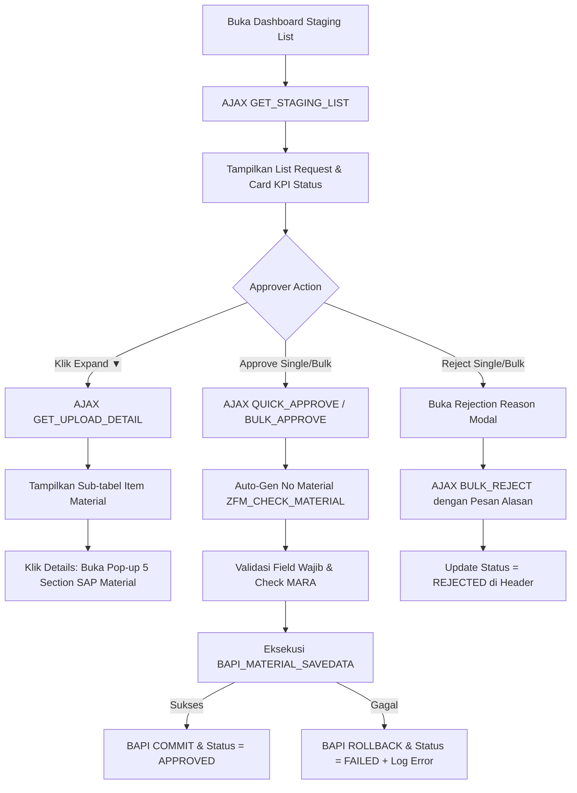

# Ringkasan Analisis Module Approval Staging Material Master

Dokumentasi ini berisi ringkasan analisis mengenai file [stagging_list.htm](file:///d:/DANIEL/ANTIGRAVITY/PROJEK/Approval/stagging_list.htm) dan controller backend [onInputProcessingR.abap](file:///d:/DANIEL/ANTIGRAVITY/PROJEK/Approval/onInputProcessingR.abap).

---

## 1. Deskripsi Singkat

Halaman **Staging Overview / Approval Dashboard** ini digunakan oleh tim Master Data Governance (MDG) / Approver untuk memantau, memeriksa, menyetujui (Approve), atau menolak (Reject) permohonan pembuatan Material Master SAP S/4HANA.

- **Teknologi**: SAP BSP (Business Server Pages), ABAP Backend, HTML5, Tailwind CSS, JavaScript (AJAX).
- **Entitas Database**: `zmdg_req_hdr` (Header Pengajuan) & `zmdg_req_dtl` (Detail Item Material).

---

## 2. Diagram & Ringkasan Alur Kerja (Workflow)

### Tahapan Alur Utama:
1. **Load & Count**: Memuat daftar pengajuan dan menghitung counter KPI status (`DRAFT`, `SUBMITTED`, `APPROVED`, `FAILED`, `REJECTED`).
2. **Review Detail**: Inspect item batch secara nested dan buka pop-up modal atribut lengkap SAP Material.
3. **Approval & SAP Integration**:
   - Auto-generate kode material jika kosong (`ZFM_CHECK_MATERIAL`).
   - Validasi data & cek duplikasi di tabel MARA SAP.
   - Panggil `BAPI_MATERIAL_SAVEDATA`. Jika berhasil, commit transaksi ke SAP master data.
4. **Rejection**: Mengubah status ke `REJECTED` beserta pencatatan alasan penolakan dan user approver.

---

## 3. Ringkasan Fitur Utama

| Fitur | Deskripsi |
| :--- | :--- |
| **KPI Summary Cards** | Card ringkasan total data per status yang dapat diklik untuk filter cepat. |
| **Filtered Search** | Filter berdasarkan kolom spesifik (*Request ID, File/Remarks, Requestor, Rejection Reason*), status, dan live text search. |
| **Expandable Row** | Sub-tabel nested untuk melihat seluruh item material per request tanpa reload halaman. |
| **Batch Action Bar** | Floating action bar untuk melakukan *Bulk Approve* & *Bulk Reject* pada banyak baris terpilih. |
| **Detail Material Modal** | Modal pop-up visual 5 section (*Basic Data, Plant & Storage, Purchasing & Logistics, Accounting & Valuation, MRP & Planning*). |
| **Integrasi SAP BAPI** | Eksekusi langsung pembuatan master data ke SAP S/4HANA via `BAPI_MATERIAL_SAVEDATA`. |
| **Feedback & Notification** | Modal dialog hasil upload SAP (Sukses/Gagal + Detail Log) dan Toast Stack Notifications. |
